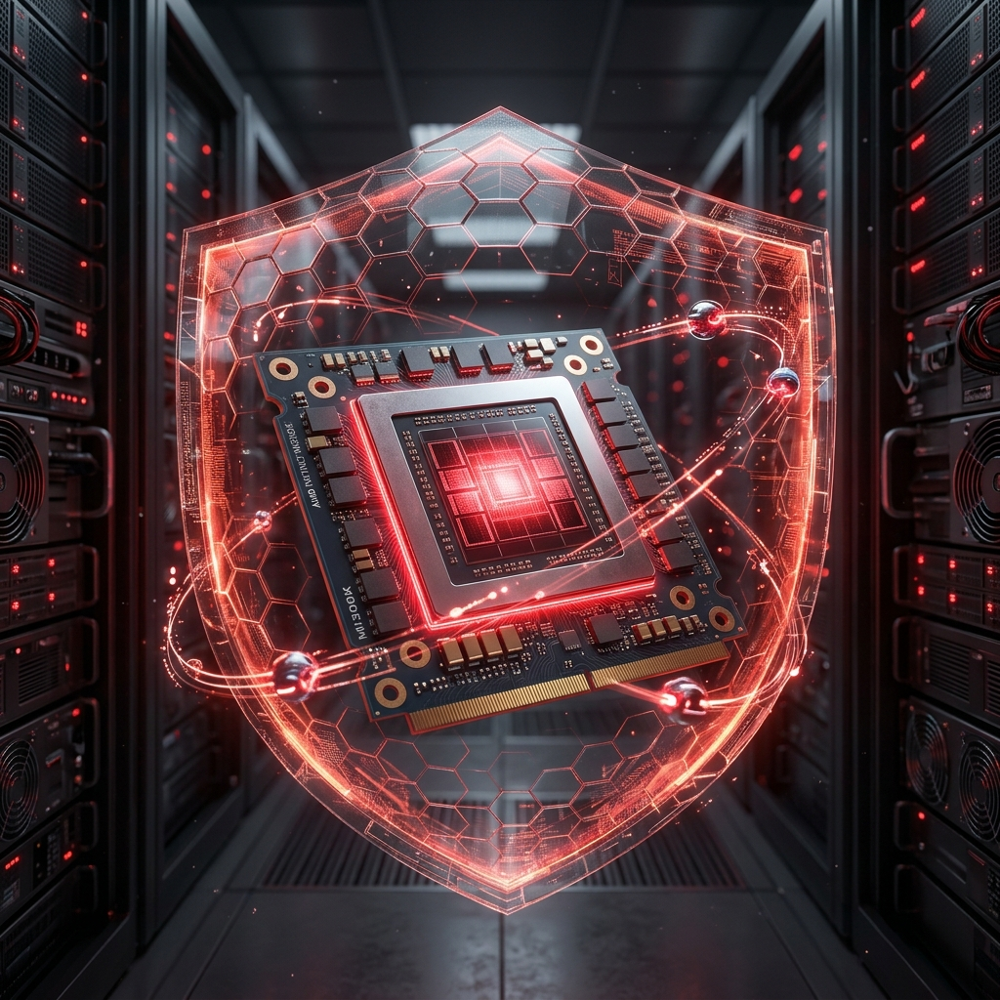
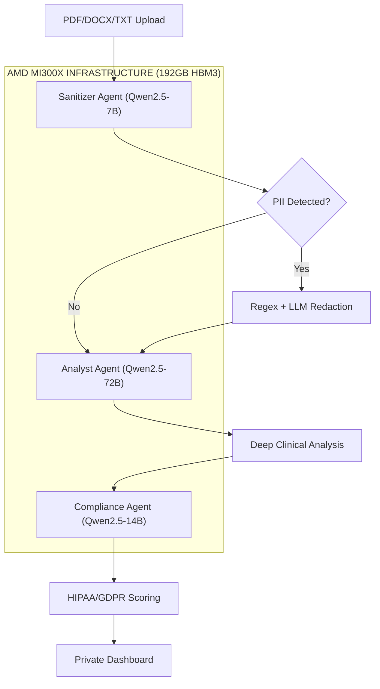
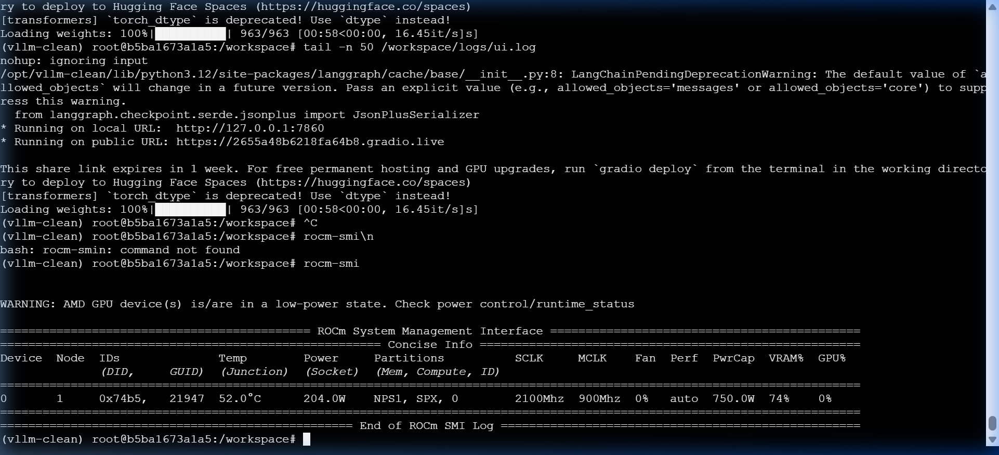
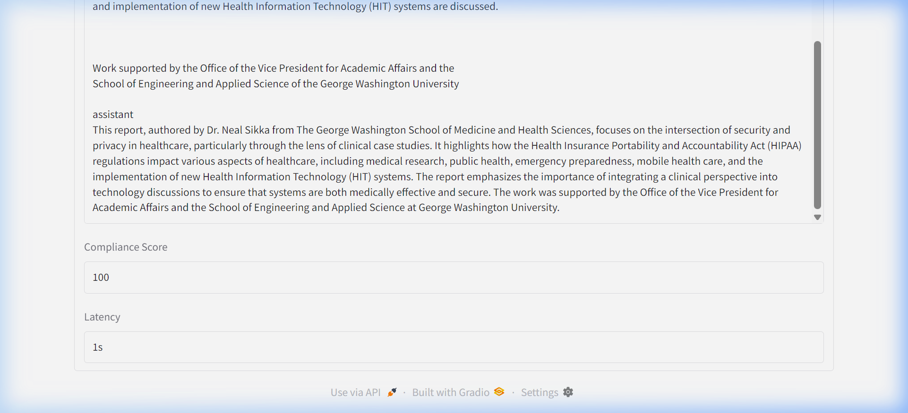

# 🛡️ SovereignAI-AMD
### "Enterprise AI that never phones home."

[](https://www.amd.com/en/products/accelerators/instinct/mi300/mi300x.html)
[](#-proven-sovereignty)

SovereignAI-AMD is a private, hardware-attested AI pipeline built for highly regulated industries (Healthcare, Finance, Government). It leverages the massive **192GB HBM3 memory** of the **AMD Instinct MI300X** to run deep, multi-agent workflows entirely on-premise.

---

## 🚀 The Process Flow
Our pipeline uses a multi-agent orchestration pattern to ensure maximum security and clinical depth.



---

## 🛠️ Technical Deep Dive

### **MI300X Memory Optimization**
We sharded the **Qwen2.5-72B** model across HBM3 partitions using ROCm-native Transformers. Our "Lean-Loading" strategy ensures stability even under heavy inference loads.


*Above: rocm-smi showing 74% VRAM saturation while running the 72B Analyst.*

### **Proven Sovereignty**
We provide cryptographic proof of data localism. No bytes leave the machine during processing.


*Above: High-precision clinical analysis generated locally on MI300X.*

---

## 🎓 Lessons Learned
For a full breakdown of our technical pivots, environment challenges, and ROCm optimization strategies, view our [MASTER_IMPLEMENTATION_DOSSIER.md](MASTER_IMPLEMENTATION_DOSSIER.md).

---

## 🛠️ Setup & Execution
1. **Initialize ROCm Environment**:
   ```bash
   bash scripts/setup_rocm.sh
   ```
2. **Download Models**:
   ```bash
   bash scripts/download_models.sh
   ```
3. **Run Sovereign Dashboard**:
   ```bash
   python src/main.py
   ```

---

## 🏆 Hackathon Submission
Built for the **AMD Pervasive AI Developer Contest**. This project demonstrates the MI300X as the ultimate platform for sovereign enterprise AI.

**[Demo Video](https://github.com/Tahir-yamin/sovereignai-amd/blob/main/docs/assets/sovereignai_amd_submission_demo.webp)** | **[Technical Spec](master_specification.md.resolved)**
